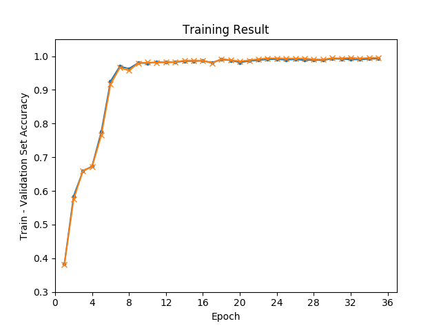

## ResNet Structure Used:

    1. Convolution 1: (3, 3, 32)
    2. Two building blocks: (3, 3, 32), no down sample
    2. Two building blocks: (3, 3, 64), (2, 2) stride down sample
    3. Two building blocks: (3, 3, 128), (2, 2) stride down sample
    4. Average pooling
    5. Flatten
    6. FC 1: (64 -> 10)
    7. Softmax
    
    Training results show that ReLU is better than Leaky ReLU for Minst dataset. So here I used ReLU.
    
## Hyper parameters:

    1. Learning rate: 0.01
    2. momentum: 0.9
    3. Batch size: 128
    4. Max epochs: 70
    
## Training results:

    Test accuracy: 0.9924
    
